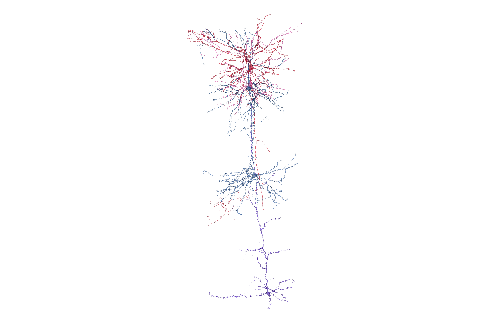

# minnie-volume (mm^3)
Reconstructions and analyses from the IARPA [MICrONS consortium](https://www.iarpa.gov/research-programs/microns) mouse visual cortex cubic mm3 serial EM volume.

**Attribution:** https://www.microns-explorer.org/terms-and-conditions 
**Citation:** https://www.microns-explorer.org/citation-policy 

***

# Contents

## Jupyter Notebook files

Use [`minnie_plotly_and_vtk_visualizer.ipynb`](https://github.com/shandran/minnie-volume/blob/main/notebooks/minnie_plotly_and_vtk_visualizer.ipynb) to generate a 2D and 3D interactive views of one or more cells of interest from the minnie mm^3 volume. Uses matplotlib, plotly, and vtk/openGL visualization methods. See an example visualization below.

