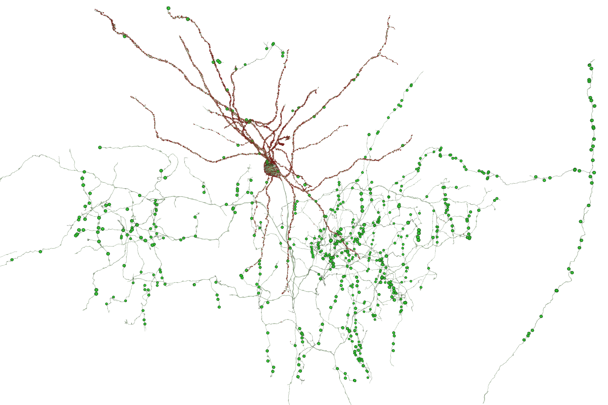

# Contents

Chandelier cells are specialized inhibitory interneurons in Layer 2/3 of the cortex, so named for having an extensive axonal arbor below the cell body reminiscent of a light chandelier. When synapsing onto target pyramidal neurons, the Chandelier axon spirals around the initial axon segment of the target neuron, making multiple synaptic contacts.

These notebooks show examples of rendering Chandelier cells in the Cubic Millimeter volume. The code can be easily adapted to filter and visualize other neuronal types as well.

You will need to create a token if you haven't already to access the Cubic Millimeter data. See [CAVEclient instructions](https://alleninstitute.github.io/microns_tutorial/quickstart_notebooks/em_py_01_caveclient_setup.html) for details. This key will need to be in your secrets folder locally for running in Jupyter or entered into your secrets in Google Colab.

**Thank you Bethanny Danskin and Forrest Collman** from the Allen Institute for providing example code notebooks and for coding assistance.

## Summary presentation

#### View example renderings in this [summary presentation](https://github.com/shandran/minnie-volume/blob/main/notebooks/chandelier/minnie_chandelier_cells.pdf) of select Chandelier cells in the Cubic Millimeter volume.

## Jupyter and Colab Notebook files

### Process for Chandelier cell visualization

#### 1. Select root ids from data table

Use [`aibs_metamodel_celltypes_v661_v2_layer_positions.ipynb`](https://github.com/shandran/minnie-volume/blob/main/notebooks/aibs_metamodel_celltypes_v661_v2_layer_positions.ipynb) (located up one directory) to query the aibs_metamodel_celltypes_v661_v2 data table. Note that this document is a work in progress and contains the latest state of proofreading at the time of release.

3D plotly scatterplot of all excitatory neurons by layer location. Note that because the volume is still being proofread, there are many neurons with incorrect layer assignments.

To search for Chandelier cells, three filters were applied, the first was creating a slice of the data table for inhibitory neurons,then selecting a subclass (PTC), and finally, a y-position location of less than 175,000 in order to find cell bodies in the approximate Layer 2/3 region of the volume (see plot).

#### 2. Review in Neuroglancer

Once root ids of interest are generated (in the previous step), visualize and manually evalutate in Neuroglancer. Use [`minnie65_statebuilder_query_root_id_by_list_colab.ipynb`](https://github.com/shandran/minnie-volume/blob/main/notebooks/chandelier/minnie65_statebuilder_query_root_id_by_list_colab.ipynb) to dynamically generate Neuroglancer links using the nglui statebuilder library. Root ids are entered as lists (this code could be incorporated in the previous step, however, I found it necessary to run this step in Google Colab due to python environment problems when attempting to run locally). The image shows a Neuroglancer view of the example neurons shown in the summary presentation above.

#### 3. Download cell meshes and synapse tables

Use [`minnie65_mesh_download_colab.ipynb`](https://github.com/shandran/minnie-volume/blob/main/notebooks/chandelier/minnie65_mesh_download_colab.ipynb) Colab notebook to download cell meshes. If you have Google Colab Pro, use the High RAM runtime.

Use [`minnie_download_synapse_tables_colab.ipynb`](https://github.com/shandran/minnie-volume/blob/main/notebooks/chandelier/minnie_download_synapse_tables_colab.ipynb) Colab notebook to download the full synapse table for a root id of interest. A special thanks to Bethanny Danskin and Forrest Collman for coding and debugging assistance.

#### 4. Visualize Chandelier-target neuron pairs

Generate 3D interactive views of Chandelier-target neuron pairs of interest using vtk/openGL. See example visualizations below.

A Chandelier cell (root id 864691135349628119) with all incoming and outgoing synapses shown. Incoming synapses shown in red and outgoing synapses shown in green.

#### Example 1

Synapses from Chandelier 864691135105583693 onto the axon initial segment region of target pyramidal neuron 864691135341563589.

#### Example 2

Synapses from Chandelier 864691135349628119 onto the axon initial segment region of target pyramidal neuron 864691135616427625.

#### Example 3

Synapses from Chandelier 864691135397985569 onto the axon initial segment region of target pyramidal neuron 864691134965433631.

